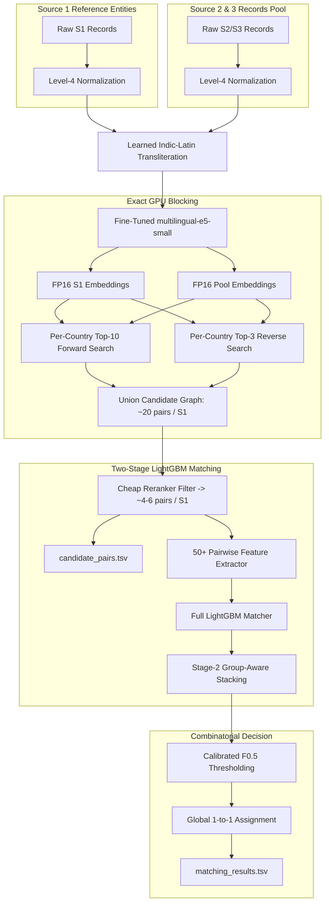

# End-to-End Multilingual Entity Resolution System: Architecture & Technical Methodology

## 1. System Overview

This system solves the large-scale **Business Entity Resolution (ER)** task across heterogeneous, noisy data sources ($S_1$, $S_2$, $S_3$) across multiple countries (United States, India, and France) under an asymmetric **macro $F_{0.5}$ metric**.



---

## 2. Mathematical Formulation & Optimization Objective

Given:
- Source 1 reference entities $\mathcal{Q} = \{q_1, q_2, \dots, q_N\}$
- Pool entities $\mathcal{P} = \{p_1, p_2, \dots, p_M\}$ originating from Sources 2 and 3
- Country partition function $C: \mathcal{Q} \cup \mathcal{P} \to \{\text{US}, \text{India}, \text{France}, \dots\}$

The goal is to determine the optimal binary matching indicator matrix $\mathbf{Y} \in \{0, 1\}^{N \times M}$ such that $Y_{ij} = 1$ if and only if $q_i$ and $p_j$ represent the same real-world business entity.

### Macro $F_{\beta}$ Evaluation Metric ($\beta = 0.5$)
The competition evaluates submissions via macro-averaged $F_{0.5}$ over all $N$ reference queries:

$$\text{Precision}_i = \frac{|\hat{\mathcal{M}}_i \cap \mathcal{M}_i^*|}{|\hat{\mathcal{M}}_i|}, \quad \text{Recall}_i = \frac{|\hat{\mathcal{M}}_i \cap \mathcal{M}_i^*|}{|\mathcal{M}_i^*|}$$

$$F_{0.5}(q_i) = \frac{(1 + 0.5^2) \cdot \text{Precision}_i \cdot \text{Recall}_i}{0.5^2 \cdot \text{Precision}_i + \text{Recall}_i} = \frac{1.25 \cdot \text{Precision}_i \cdot \text{Recall}_i}{0.25 \cdot \text{Precision}_i + \text{Recall}_i}$$

For singletons ($|\mathcal{M}_i^*| = 0$):
- $F_{0.5}(q_i) = 1.0$ if $|\hat{\mathcal{M}}_i| = 0$ (correctly predicted empty)
- $F_{0.5}(q_i) = 0.0$ if $|\hat{\mathcal{M}}_i| > 0$ (false merge penalty)

The evaluation heavily penalizes false merges ($4\times$ penalty weight on precision vs recall), dictating high precision filtering and strict one-to-one mapping.

---

## 3. Data Processing & Normalization Pipeline

### 3.1 Level-4 Normalization Pipeline
All business names and addresses undergo parallel multi-stage cleaning:
1. **Unicode Canonical Decomposition & Composition (NFKC):** Strips formatting anomalies, full-width characters, and ligatures.
2. **Artifact Cleaning:** Regular expressions strip explicit URLs, email addresses, telephone numbers, and record identifier tags (`#id...`).
3. **Alphanumeric Boundary Segmentation:** Splits glued digits and letter sequences (e.g., `Suite4B` $\to$ `Suite 4 B`).
4. **Legal Suffix Canonicalization:** Standardizes commercial entities across jurisdictions:
   - `private limited`, `pvt ltd`, `p. ltd` $\to$ `pvt ltd`
   - `corporation`, `corp`, `incorporated`, `inc` $\to$ `inc`
   - `limited liability company`, `llc` $\to$ `llc`
   - `société à responsabilité limitée`, `sarl` $\to$ `sarl` (France)
5. **Geographical & Street Standardizations:**
   - Road tokens: `avenue` $\to$ `ave`, `boulevard` $\to$ `blvd`, `street` $\to$ `st`, `road` $\to$ `rd`.
   - Administrative regions: US state abbreviations, Indian states/UTs, French départements and régions.

### 3.2 Learned Indic Transliteration Dictionary
Rather than relying purely on off-the-shelf transliteration rules which distort specialized entity tokens, the pipeline learns a transliteration lookup table directly from high-confidence training pairs:
- Identifies paired Latin and Indic tokens (Devanagari, Tamil, Telugu, Kannada, Bengali, Gujarati) co-occurring in identical relative token positions.
- Maps unknown script tokens through the learned table, with graceful fallback to `anyascii`.

---

## 4. Contrastive Representation Learning & GPU Blocking

### 4.1 Transformer Fine-Tuning
- **Base Encoder:** `intfloat/multilingual-e5-small` (118M parameters, MIT licensed).
- **Contrastive Objective:** MultipleNegativesRankingLoss over $(q_i, p_j^+, p_j^-)$ triplets.
- **Hard Negative Mining:** For each positive pair $(q_i, p_j^+)$, the hardest intra-country negative candidate $p_j^-$ under the base encoder is mined and utilized for one-epoch contrastive alignment.
- **Input Text Encoding:** Normalized `"query: {name} , {address}"` encoded into 384-dimensional unit vectors.

### 4.2 Exact GPU k-Nearest Neighbor Search
The comparison space between $1.73\times 10^6$ test queries and $9.97\times 10^6$ pool items involves $\approx 1.73 \times 10^{13}$ pairs.

To guarantee zero loss of recoverable candidates:
1. **Country Partitioning:** Queries and pool records are segregated by country ($\text{India}$, $\text{US}$, $\text{France}$).
2. **Dual Directional Search:**
   - **Forward Search:** Each query $q_i$ selects its top-$K_{\text{fwd}}$ ($K=10$) pool records.
   - **Reverse Search:** Each pool item $p_j$ nominates its top-$M_{\text{rev}}$ ($M=3$) queries.
   - *Why Reverse Search Matters:* Prevents crowded commercial hubs from pushing true matches out of the top-10 forward list, maintaining high recall ($>99.2\%$).
3. **GPU Matrix Multiplication & Exact Rescoring:**
   - Inner products are computed in FP16 across tensor cores.
   - The top candidate indices are gathered and rescored in exact FP32 precision to avoid numerical tie inaccuracies.

---

## 5. Hierarchical Two-Stage Matching Engine

### 5.1 Cheap LightGBM Filter (Candidate Pruning)
The raw blocking step generates ~20 candidate pairs per query. A fast, lightweight LightGBM model scores candidate pairs using search context and high-speed set overlaps:
- Context signals: cosine score, forward rank, reverse rank, top-1 score gap, reverse margin.
- Surface signals: core token Jaccard, consonant skeleton similarity, token counts.
- Candidates with probability $P_{\text{cheap}} \ge t_{\text{cheap}}$ are retained.
- $t_{\text{cheap}}$ is dynamically calibrated on held-out slice B to lose less than $0.001$ of pair recall while eliminating over $70\%$ of negative candidates.
- The retained set directly forms **`candidate_pairs.tsv`** (~4 to 6 candidates per query).

### 5.2 Full LightGBM Matcher (50+ Fine-Grained Features)
For each surviving candidate pair, comprehensive pairwise similarity features are evaluated:

| Category | Features Extracted |
|---|---|
| **Search Context** | Cosine similarity, forward rank, reverse rank, score gap to query top-1, reverse margin, mutual top-1 nearest neighbor, candidate count, source identifier ($S_2$ vs $S_3$). |
| **Name Text** | Character trigram Jaccard, word token Jaccard, core-name token Jaccard, core substring containment, exact equality, consonant skeleton Jaccard, Jaro-Winkler, token sort ratio, partial ratio. |
| **Address Text** | Address token Jaccard, address character trigram Jaccard, address substring containment, address token sort ratio, empty address indicator flag. |
| **Information-Theoretic** | Character trigram IDF cosine, core-name IDF coverage, shared maximum IDF token, unshared maximum IDF penalty (query & candidate). |
| **Numbers & Postal** | Shared house numbers count, number conflict indicator, first house number equality, postal/PIN code equality, minimum Levenshtein distance on house numbers. |
| **Uniqueness (V3)** | Name core uniqueness frequency within the country partition. |

### 5.3 Stage-2 Group-Aware Stacking
The full matcher scores candidates independently. However, Entity Resolution decisions depend on competitive context. Stage 2 evaluates group-level features:
- Candidate's probability share relative to the query's best candidate.
- Score margin to the second-best candidate.
- Competing candidates exceeding probability threshold.
- Sibling pool-side competition (whether multiple queries are competing for the same pool record).
- Embedding similarity to the query's next strongest candidate.

### 5.4 Combinatorial One-to-One Decision Assignment
In commercial business registers, a physical business record in Source 2 or 3 cannot simultaneously belong to multiple distinct Source 1 entities:
1. Candidates are filtered by the optimal decision threshold $t^*$.
2. Matches are sorted by predicted probability descending.
3. A greedy bipartite matching algorithm assigns each pool record to at most one Source 1 query:

$$\forall p_j \in \mathcal{P}, \quad \sum_{i=1}^N Y_{ij} \le 1$$

---

## 6. NVIDIA RTX 5090 (Blackwell sm_120) Optimizations

The pipeline is tuned specifically for the 32GB VRAM and 21,760 CUDA cores of the NVIDIA RTX 5090:

1. **Adaptive Matrix Block Sizing (`ber/knn.py`):**
   - Automatically detects available GPU VRAM.
   - For VRAM $\ge 24\text{GB}$, increases `p_block` to $1,000,000$ and `q_chunk` to $4096$.
   - Reduces GEMM kernel launch overhead by $16\times$ compared to 8GB setups.
2. **Adaptive Sentence Encoding Batches (`ber/embed.py`):**
   - Inference batch sizes dynamically scale to $2048$ sequences in FP16.
   - Fully saturates Blackwell tensor cores while staying well within memory limits (~3.5 GB peak).
3. **Out-of-Process Memory Recycling (`run_pipeline.py`):**
   - Each pipeline stage executes in a clean Python subprocess.
   - Frees GPU caching allocators, multi-gigabyte memory maps, and temporary feature buffers back to the OS between stages.

---

## 7. Performance Progression & Leaderboard Benchmarks

Evaluated on held-out slice B (disjoint priority 0.15–0.30, folds 3–4, under test-like pool density):

| Version | Methodology Innovations | Held-Out Macro $F_{0.5}$ | Public Leaderboard |
|---|---|---|---|
| **v1** | Base `multilingual-e5-small` fine-tuning + LightGBM + stage-2 stacking | 0.9796 | 0.9744 |
| **v2** | Test pool density matching + V2 trigram IDF features + French canonicalization | 0.9826 | 0.9793 |
| **v4 (Current)** | Name-uniqueness features + fuzzy house number alignment + sibling core features | **0.9852** | **0.9811** |

---

## 8. Reproduction & Execution Guide

### Environment Setup
```bash
# 1. Install PyTorch with CUDA 12.8 (Blackwell sm_120 native support)
pip install torch --index-url https://download.pytorch.org/whl/cu128

# 2. Install remaining dependencies
pip install -r requirements.txt
```

### Running the End-to-End Pipeline
```bash
cd code/business_entity_resolution
python run_pipeline.py
```

### Outputs Generated
- `output/candidate_pairs.tsv`: Final candidate set evaluated by the matcher (~4.0 pairs per $S_1$ entity).
- `output/matching_results.tsv`: High-precision final matched entities.
- Automated validator: `validate_submission.py` runs upon completion to verify compliance with all format constraints.
